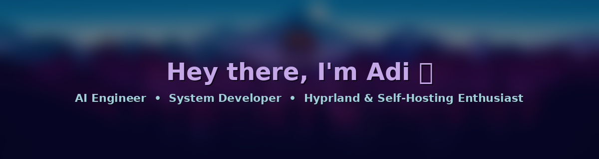

<div align="center">

  <!-- Blurred Wallpaper Hero Banner with Text Overlay -->
  

  <br/><br/>

  <p align="center">
    <a href="https://github.com/AdiGoCrazy/dotfiles">
      
    </a>
    <a href="https://archlinux.org">
      
    </a>
    <a href="https://hyprland.org">
      
    </a>
    <a href="https://github.com/AdiGoCrazy/radarr-agent">
      
    </a>
  </p>

</div>

---

### ❄️ About Me

```yaml
Name: Aditya Akkannavar
Handle: AdiGoCrazy
Role: AI Engineer / Software Developer
Current Focus: Autonomous AI Agents, Local LLMs, Self-Hosted Infrastructure & Developer Tooling
Passions: AI development, home servers, self-hosting, developer tooling & terminal applications
```

- 🤖 **Autonomous AI Agents**: Building LLM-driven agents (`radarr-agent`) connecting local Ollama models to self-hosted microservices.
- 💻 **Terminal Interfaces & Tools**: Building keyboard-driven developer tools and dashboards with Python & `Textual` (`ProjectTUI`).
- 🖥️ **Home Servers & Systems**: Containerizing services with Docker and managing Linux self-hosted stacks.
- 🏆 **Hackathons**: Developed an enterprise transit operations and fleet management platform (`Odoo TransitOps`).
- ⚡ **Fun Fact**: I love connecting local LLMs to self-hosted tools to automate complex everyday workflows!

---

### 🛠️ Technologies & Tools

<div align="center">

  <!-- AI & Languages -->
  
  
  
  
  

  <br/>

  <!-- Desktop & Infrastructure -->
  
  
  
  
  

</div>

---

### 🚀 Featured Projects

| Repository | Description | Key Tech | Link |
| :--- | :--- | :--- | :---: |
| 🤖 **[radarr-agent](https://github.com/AdiGoCrazy/radarr-agent)** | Autonomous, self-hosted AI agent managing local media stacks via natural language and local LLMs. | `LangGraph` `FastMCP` `Ollama` `Python` | [View Repo](https://github.com/AdiGoCrazy/radarr-agent) |
| 🌌 **[dotfiles](https://github.com/AdiGoCrazy/dotfiles)** | Modern Hyprland + Waybar desktop rice featuring custom GTK3 Python dockets, live GPU & Ollama telemetry. | `Hyprland` `Waybar` `GTK3` `Arch Linux` | [View Repo](https://github.com/AdiGoCrazy/dotfiles) |
| 💻 **[ProjectTUI](https://github.com/AdiGoCrazy/ProjectTUI)** | Keyboard-driven Terminal User Interface for local project discovery, dependency management & container execution. | `Python` `Textual` `TUI` `AsyncIO` | [View Repo](https://github.com/AdiGoCrazy/ProjectTUI) |
| 🎥 **[Video-Generator](https://github.com/AdiGoCrazy/Video-Generator)** | Desktop GUI application built for automated video editing, composition, and rendering. | `Python` `CustomTkinter` `MoviePy` | [View Repo](https://github.com/AdiGoCrazy/Video-Generator) |
| 🚆 **Odoo TransitOps** | Enterprise transit operations and fleet management platform developed as a hackathon project. | `Python` `Odoo` `PostgreSQL` | [View Repo](https://github.com/AdiGoCrazy) |

---

### 📊 GitHub Activity & Statistics

<div align="center">
  <table border="0">
    <tr>
      <td>
        
      </td>
      <td>
        
      </td>
    </tr>
  </table>

  <br/>

  
</div>

---

### 🖥️ Desktop Setup Highlights

- 🎨 **Frosted Glass UI**: Custom GTK3 Python popovers (`bt_docket.py`, `wifi_docket.py`, `audio_docket.py`, `clock_docket.py`, `power_docket.py`) with cross-docket IPC single-active window locking.
- 🕒 **GNOME-Style Date & Time**: Animated Cairo vector analog clock + scrollable GTK month/year calendar.
- 🔋 **Smart Battery Daemon**: Hardware AC polling daemon with custom dunst OSD toasts and login chimes.
- 📦 **Dotfiles Repo**: [AdiGoCrazy/dotfiles](https://github.com/AdiGoCrazy/dotfiles) with 1-step `install.sh` automated Arch setup.

---

<div align="center">
  <sub>Styled with 💜 to match Adi's Hyprland Frosted Glass Desktop</sub>
</div>
